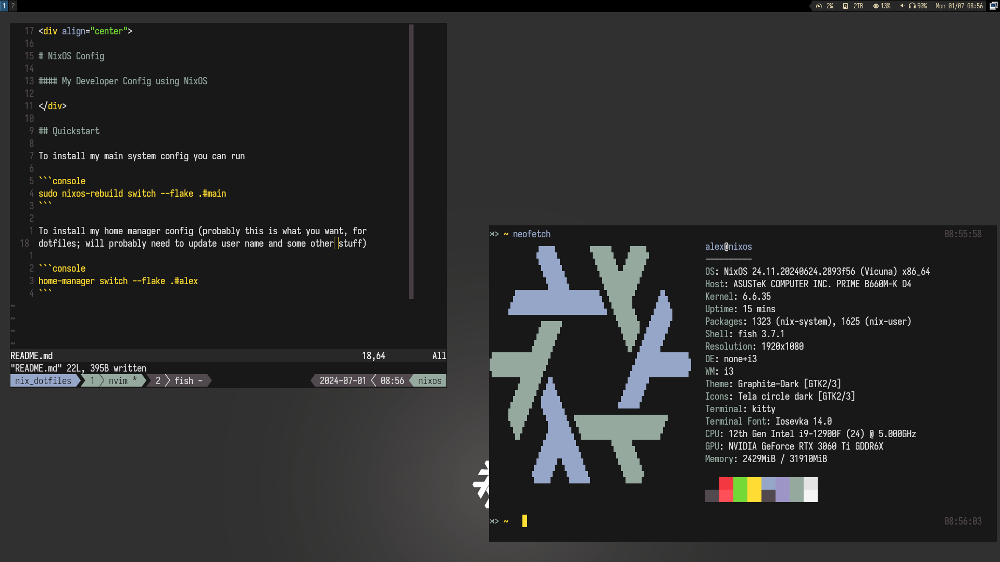

<div align="center">

# Configuración de NixOS

#### Mi configuración de desarrollador con NixOS



</div>

## Estructura

- `flake/` - módulos de flake-parts; los hosts y usuarios se descubren automáticamente a partir de los
  nombres de directorio bajo `hosts/` y `home/`.
- `hosts/<name>/` - configuración del sistema NixOS por máquina.
- `home/<user>/` - configuración de home-manager por usuario, compuesta desde `home/modules/`.

## Inicio rápido

La configuración del sistema se aplica por host (`hosts/nixos/` -> `.#nixos`):

```console
sudo nixos-rebuild switch --flake .#nixos
```

Home-manager funciona de forma independiente (por usuario, `home/alex/` -> `.#alex`), por lo que también
funciona en máquinas no NixOS únicamente para dotfiles:

```console
home-manager switch --flake .#alex
```
