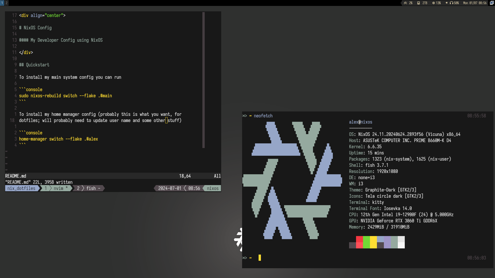

<div align="center">

# NixOS Config

#### My Developer Config using NixOS



</div>

## Layout

- `flake/` - flake-parts modules; hosts and users are auto-discovered from the
  directory names under `hosts/` and `home/`.
- `hosts/<name>/` - per-machine NixOS system config.
- `home/<user>/` - per-user home-manager config, composed from `home/modules/`.

## Quickstart

System config is applied per host (`hosts/nixos/` -> `.#nixos`):

```console
sudo nixos-rebuild switch --flake .#nixos
```

Home-manager is standalone (per user, `home/alex/` -> `.#alex`), so it also
works on non-NixOS machines for dotfiles alone:

```console
home-manager switch --flake .#alex
```
