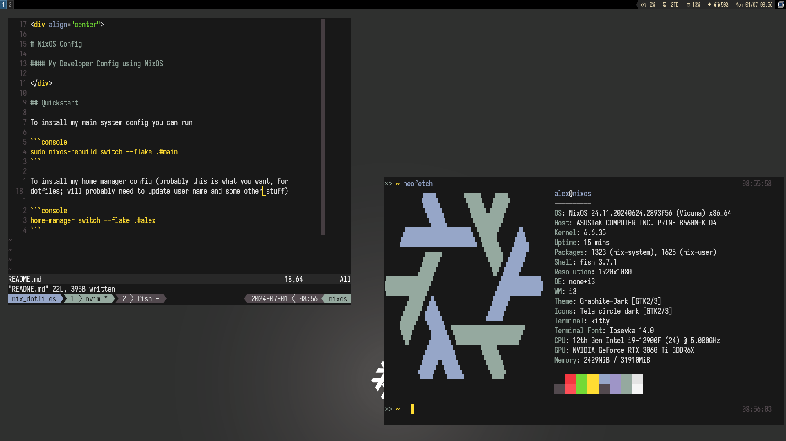

<div align="center">

# NixOS Config

#### My Developer Config using NixOS



</div>

## Quickstart

To install my main system config you can run

```console
sudo nixos-rebuild switch --flake .#main
```

To install my home manager config (probably this is what you want, for
dotfiles; will probably need to update user name and some other stuff)

```console
home-manager switch --flake .#alex
```
